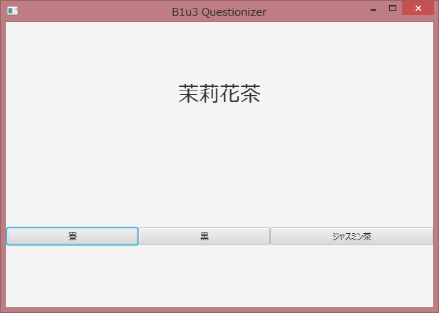

# B1u3Questionizer

Create questions and give you 3 choices from a table file.

## Download

<a id="raw-url" href="https://raw.githubusercontent.com/kyuvie/Questionizer/develop/Questionizer.zip">Download Zip</a>

Extract and run bin/Questionizer.bat

## How to use

```
% git clone https://github.com/kyuvie/Questionizer.git
% gradlew run --args="-f sample.txt"
```

or lauch GUI

```
% gradlew run --args="-g"
```

Choose table files directory 

## sample.txt

```
QuestionStatement1 - answer1
QuestionStatement2 - answer2
QuestionStatement3 - answer3
QuestionStatement4 - answer4
```

## images





## Testing

```
gradlew test
```

